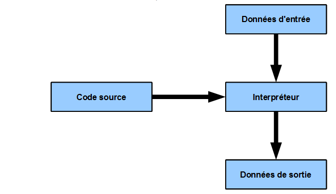
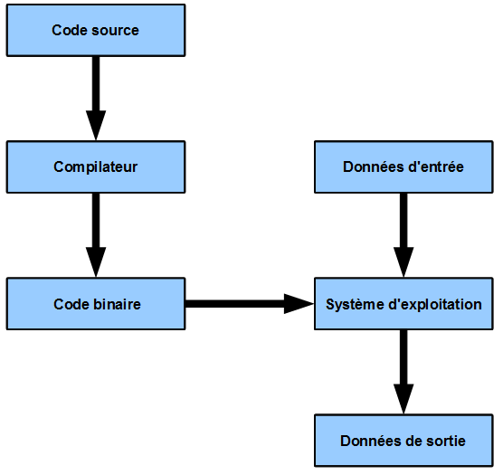
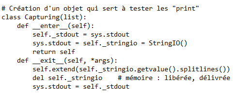
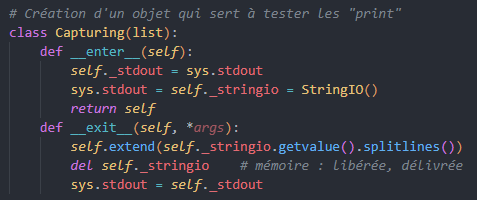
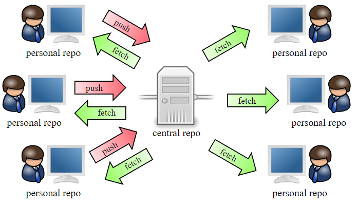

# Comment être un super développeur

Qu'est-ce qu'on va aborder ?
+ Les langages de programmation, comment choisir ?
+ Les outils du bon développeur
  + Les IDE, à quoi ça sert et comment ça marche ?
  + Git, pour bosser en groupe !
+ Les bonnes pratiques

----------------------------------------------------------------

## Comment choisir son langage de programmation ?

Il faut savoir que, théoriquement, tous les langages de programmation peuvent faire la même chose. C'est juste que chacun d'entre eux a ses particularités, et qu'ils sont, en général, créés afin de répondre à un besoin. Aussi, certains langages sont plus populaires en fonction du domaine. Ainsi, quelqu'un qui travaille dans les statistiques utilisera probablement `R`, là où quelqu'un qui travaille dans l'analyse des données utilisera plus probablement `Python`.

Mais du coup, par quel langage commencer ?

N'étant pas la science infuse, je peux pas vous donner un choix "parfait", mais je vais vous dire ce que j'ai vu quand j'ai commencé la fac, dans quel ordre et pourquoi (car je demande souvent à mes professeurs pourquoi on fait les choses d'une manière et pas d'une autre).

Tout d'abord, nous avons commencé par `Python`. C'est un langage avec une syntaxe super facile, le seul "prérequis" est de parler un tout petit peu d'anglais, et encore. Cela permet d'apprendre les bases de la programmation, on pourrait dire "la manière de penser" en informatique.

Ensuite, nous avons appris les mêmes bases mais cette fois-ci en `C`. La grande différence est que, là où une grande partie du travail est "machée" en `Python`, `C` demande de faire beaucoup d'étapes "intermédiaires". C'est un langage qui est (entre guillemets) plus proche de la machine. Il est compilé et donc plus rapide que `Python`, qui, lui, est interprêté. 

Code interprêté

 
 

Code compilé

 
 

Pour faire simple, le code interprêté va utiliser un exécutable pour traiter les instructions tandis que, quand on compile le code, celui-ci est transformé en binaire, qui sera alors compris directement par le système d'exploitation. Il est donc plus rapide à l'exécution (mais nécessite donc d'être compilé).

Ensuite, une fois que nous avons pu travailler avec des langages différents par "nature", nous avons vu ce qu'était un paradigme de programmation, une manière compliquée de dire "comment approcher un problème". Il en existe de nombreux, mais, ici nous avons appris :
+ la programmation fonctionnelle, qui n'utilise que des fonctions, et qui fait que le code n'est qu'une suite d'évaluations de fonctions (c'est un peu spécial mais assez stylé une fois qu'on a compris)
+ la programmation orientée objet, qui permet de créer des classes qui définissent un nouveau type de variables personnalisé, qui peut avoir ses propres fonctions, etc

Pour mieux saisir ces concepts, nous avons encore une fois travaillé les bases, en allant plus loin cette fois-ci, avec des langages créés pour ces paradigmes : OCaml et Java, respectivement. Pour être honnête, c'est super intéressant, mais certains langages vous permettent de faire les deux (comme Python par exemple).

Par la suite, nous avons surtout appris des choses sur des thèmes dans l'informatique, comme la Data Science, l'IA, et j'en passe. Chaque matière demandait des projets dans des langages divers, mais celui qui revenait le plus souvent était `Python`, donc je ne peux que vous le conseiller, du moins pour apprendre.

----------------------------------------------------------------

## Les outils du bon développeur

### Les IDE, à quoi ça sert et comment ça marche ?

Pour taper du code, on peut se contenter du bloc notes. Mais bon c'est quand même pas fou fou, on y voit pas grand chose.

C'est pour cela qu'existent les IDE (Integrated Development Environment), des logiciels dédiés à ça.

Il en existe plusieurs, comme par exemple `Eclipse`, `Spyder`, `Code::Blocks` ou encore, le plus célébre, `Visual Studio Code`. Je parlerai de `VSCode`, car c'est celui que j'utilise, que ce soit chez moi ou quand je travaille.

Mais déjà, qu'est-ce que ça nous apporte ? Regardons un bout de code avec le bloc note :

Code, vue bloc-notes

 
Et maintenant, avec `VSCode` :

Code, vue VSCode

 

C'est quand même vachement plus clair avec `VSCode` !

Mais en plus de ça, on peut exécuter son code dans la même fenêtre, ce qui est plus efficace que d'ouvrir la console pour aller tester son code.

Mais alors, pour revenir à `VSCode`, pourquoi cet IDE et pas un autre ?

Après en avoir testé plusieurs, j'ai choisi de garder celui-ci car il contient énormément d'extensions, et permet aussi de travailler sur à peu près tous les langages qui existent. Parmi les extensions, il y en a qui ajoutent des raccourcis clavier d'autres IDE pour s'adapter, d'autres qui ajoutent le support de certains fichiers, et surtout, des extensions qui permettent de générer du code, un peu comme le correcteur automatique du clavier, mais en surpuissant.

Il faut noter que `VSCode` est open-source, mais qu'il appartient à Microsoft.

C'est une excellente transition pour parler d'un autre outil qui appartient maintenant à Microsoft, `GitHub`. C'est une sorte de mix entre réseau social de développeurs et un cloud qui contient du code.

### Git, pour bosser en groupe !

Cet outil est basé sur `Git`, un logiciel de gestion des versions. C'est un peu spécial comme nom, mais le principe est assez simple : cela permet, étant donné un dossier contenant du code, de le mettre à jour tout en ayant un historique de ce qui a été fait dessus.

Mais bon, juste ça, on pourrait le faire à la main.

La vraie force de `Git` réside sur le fait qu'on puisse l'utiliser à plusieurs sur le même dossier, si celui-ci est dans un serveur.

Git

 

Cela permet à plusieurs développeurs de travailler sur le même projet en simultané, sans avoir de conflits de versions, tout en laissant d'autres personnes télécharger le code. C'est quelque chose d'extrêmement puissant car très efficace. Pour vous dire, c'est quelque chose que j'ai pu utiliser très régulièrement en cours, que j'utilise presque tous les jours au travail, et souvent quand je travaille sur des projets persos.

Je ne peux que vous conseiller de vous renseigner sur `Git`, surtout si vous voulez faire un projet avec des amis.

`GitHub`, évoqué plus tôt, permet de travailler en utilisant `Git`, mais ajoute de nombreuses autres fonctionnalités, comme le fait de suivre des projets, de "copier" un projet pour le customiser de son côté, le fait de mettre en ligne une page web en mettant son code dans un dossier, etc. Et tout ça, c'est vachement pratique.

Aussi, sur `VSCode` (on y revient), il y a une extension pour travailler encore plus efficacement avec `GitHub`, et c'est super pratique quand on ne connait pas toutes les commandes de `Git`.

----------------------------------------------------------------
## Les bonnes pratiques

### Comment ne plus être bloqué sur un problème

Il est possible de "bloquer" sur certaines choses, ça arrive à tout le monde. Cependant, en informatique, il y a énormément de ressources pour répondre à (presque) toutes vos questions.

Tout d'abord, il faut bien utiliser son moteur de recherche.

Cela peut vous paraître évident, mais une bonne recherche ne contient que les mots clés.

Ainsi, on préfèrera `python if` à `comment marchent les boucles if en python ?`. Si un mot n'est pas spécifique à ce que vous recherchez, il n'est **probablement** pas nécessaire.

Il peut vous être utile de spécifier une langue si vous ne parlez pas bien anglais, mais je vous conseille fortement d'avoir au moins quelques rudiments, afin de pouvoir utiliser le plus de ressources possibles.

Ensuite, il faut absolument connaître LE site le plus important : Stack Overflow

[Stack Overflow](https://stackoverflow.com/) est un site sur lequel des internautes posent des questions, et où d'autres répondent, sur le thème de la programmation informatique. Il est possible de voter pour ou contre une réponse, afin d'afficher la réponse la plus pertinente tout en haut.

C'est le site que vous rencontrerez le plus régulièrement en premier résultat sur google quand vous rechercherez des choses sur la programmation.

Et, enfin, en dernier recours : la documentation

En informatique, presque tout est documenté, et cette documentation se trouve généralement sur internet.

Elle est généralement très complète et est parfois complexe, mais elle est très utile quand on a une question précise sur une fonctionnalité.

La documentation pour Python se trouve [ici](https://docs.python.org/fr/3/).

### Programming style

Pour finir, un point souvent négligé, le style de programmation. C'est un ensemble de règles que l'on utilise lors de l'écriture de code afin d'améliorer sa productivité et d'éviter de nombreuses erreurs. De plus, cela aide les gens à relire votre code, et ça risque d'arriver assez souvent, vu qu'il est très rare de ne jamais bosser en groupe quand on code des choses.

Si ça peut vous convaincre, une étude a montré que les développeurs `Python` qui mettaient des espaces au lieu de tabulations avaient un salaire en moyenne 8.6% plus élevé. Un détail aussi minime change donc pas mal de choses, imaginez pour le reste !